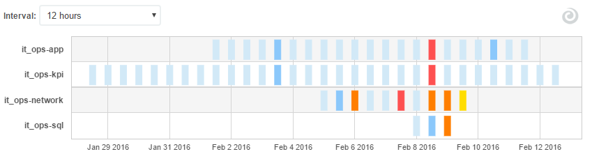
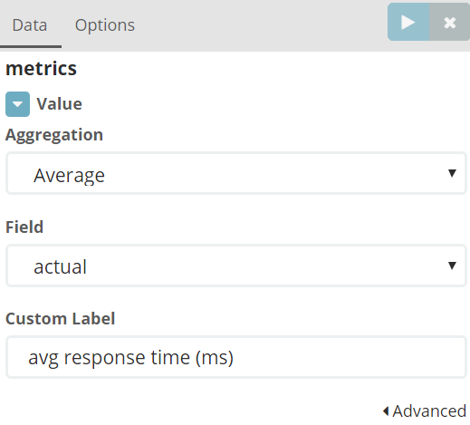
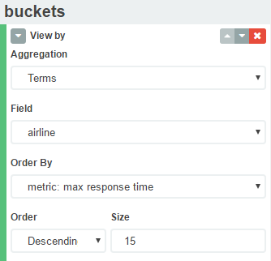
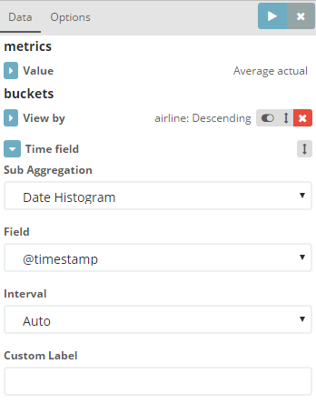
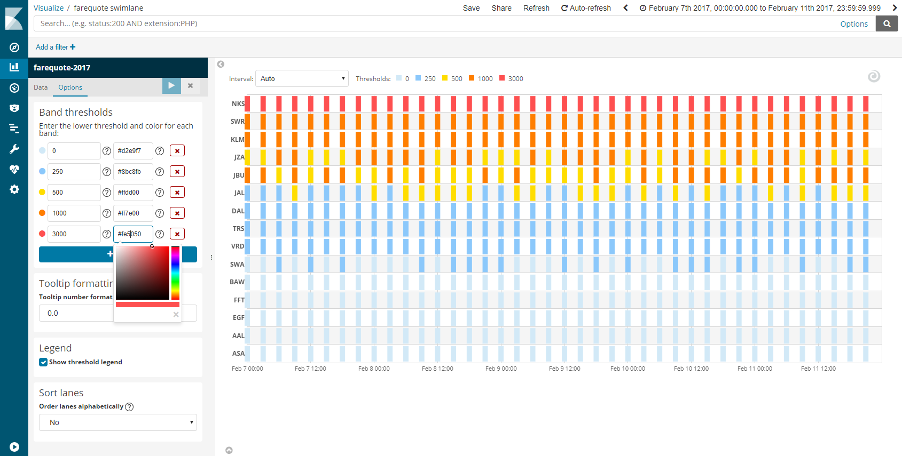

# Swimlane visualization for Kibana

A swimlane visualization for Kibana 4.

The visualization displays the behavior of a metric value over time across a field from the results.
Each lane displays a different value of the selected field, with the relative size of the metric
for that field over each time indicated by the color of the symbol at that time.



An example use case is shown below, where the swimlane is displaying data from a flight comparison website.
The average response time for each airline is plotted in a separate lane, with response times shown depending
on magnitude, with blue used for the shortest response times, then yellow, orange, and red for the longest
response times:


## Compatibility

This plugin has been tested with Kibana versions 4.3, 4.4, 4.5 and 4.6.

## Installation

### Automatic

Windows:

```
bin/kibana plugin -i prelert_swimlane_vis -u https://github.com/prelert/kibana-swimlane-vis/archive/v0.1.0.zip
```

Linux or OS X:

```
bin/kibana plugin -i prelert_swimlane_vis -u https://github.com/prelert/kibana-swimlane-vis/archive/v0.1.0.tar.gz
```

## Usage

The first step in creating the visualization is to configure the metric that will be displayed.
Select the Elasticsearch aggregation to be used - count, average, sum, min and max are currently available.
If using average, sum, min or max, select the numeric field that will be aggregated. From Kibana 4.5, a
custom label can also be entered if desired, which will be displayed against the value in tooltips. In our
example we are plotting maximum response time, with the numeric value stored in the `actual` field of the results:



The next step is to configure the field by which you want the results to be split to form the swimlanes using
an Elasticsearch terms aggregation. Select the field for the *View by* bucket aggregation, which will typically be
one of the *string* type fields in your results. Use the *Size* dropdown to select the maximum number of swimlanes
that will be displayed. In our example, we will be viewing results by `airline`, showing the top 15 airlines by
maximum response time:



Note if no *View by* buckets are configured, a single swimlane will be displayed showing the behavior of the
selected metric over all results.

The final step is to select the time field in your results. The time frame for the intervals in the swimlane
visualization can be specified in terms of seconds, minutes, hours, days, weeks, months, or years, or just
leave it to the *Auto* setting of Kibana which will aim to pick the optimum interval depending on the time
span of the query. An *interval* dropdown control is also available at the top of the swimlane for use when
the visualization has been saved and added to a dashboard.



## Options

The options tab allows you to configure the color band thresholds and the format of the value shown
in the tooltip when hovering over a band in the swimlane.



### Color band thresholds

The swimlane uses five different colors to indicate the value of the metric over a time interval, from
light blue for the smallest values, through to red for the largest values. By default, the thresholds are
set for a 0 to 100 range of values, with the ranges set to:

| Range            | Color         |
| -----------------|---------------|
| 0 <= value < 3   | light blue    |
| 3 <= value < 25  | blue          |
| 25 <= value < 50 | yellow        |
| 50 <= value < 75 | orange        |
| 75 <= value      | red           |

To alter the numeric ranges for any of the bands, use the *Band thresholds* section of the Options tab to
enter the desired value, noting that the values entered define the *lower* threshold for each band. For example,
in the screenshot above, the thresholds have been adjusted to suit the range of response times from the flight
comparison website data, with values of 3000 or more displayed in red.

It is not yet possible to alter the number of color bands, nor the colors used for each range.

### Tooltip formatting

By default, the value shown in the tooltip when hovering over a band in the swimlane is shown to one decimal
place. To alter the format of the tooltip to suit values in your data set, enter the desired format in the
*Tooltip formatting* section of the Options tab. Refer to the [Numeral.js](http://numeraljs.com/) documentation
for the range of accepted formats, with that being the library used to format the value in the tooltip.


## Issues
Please file issues [here](https://github.com/prelert/kibana-swimlane-vis/issues).


## About Us

Prelert is the leading provider of behavioral analytics for IT security, IT operations, and business operations teams. Our solution analyzes log data, finds anomalies, links them together and lets the data tell the story behind advanced security threats, IT performance problems, and business disruptions.

Leveraging machine learning anomaly detection and other behavioral analytics capabilities, the solution automates the analysis of massive data sets, eliminating manual effort and human error. Hundreds of progressive IT organizations rely on Prelert to detect advanced threat activity, reduce false positive alerts and enable faster root cause analysis. Prelert lets your data tell the story.

www.prelert.com
